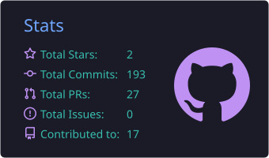
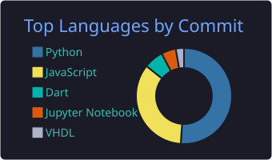
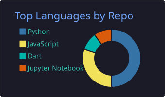
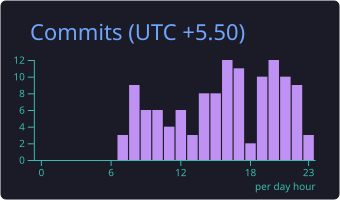

 

  
  &nbsp;
  

  
  &nbsp;
  
  &nbsp;
  
  &nbsp;
  

&nbsp;

&nbsp;

 

---

## About

I am a **Computer Science and Engineering undergraduate** at the **University of Moratuwa**, specializing in **Data Science**. My work sits at the intersection of **research** and **engineering** — I work on multilingual NLP and applied machine learning, and I build the full-stack systems and data pipelines that put those ideas into production.

My research interests centre on how language is represented, retrieved and evaluated by machines, and where mainstream tooling breaks down for languages it was never designed around. Alongside that, I care about **interpretable models** — what a model is actually keying on, and whether a result holds outside the sample it was fit to.

On the engineering side I ship end to end: **fintech platforms**, **microservice backends**, **streaming data pipelines**, **container orchestration**, and **digital design** when the problem calls for it. Building systems that survive contact with real data has taught me to value reproducibility and clear reasoning over clever results.

**Open to:** Research Internships · ML/NLP Engineering Roles · Software Engineering Internships · Research Collaborations · Open Source Contributions

---

## Tech Stack

### Languages

  

### Machine Learning & Data

  

### Backend & Databases

  

### Frontend & Mobile

  

### Cloud, DevOps & Tooling

  

---

## GitHub Analytics

&nbsp;

  

&nbsp;

---

*Good research and good engineering ask the same question: does this hold up outside the case you built it for?*

